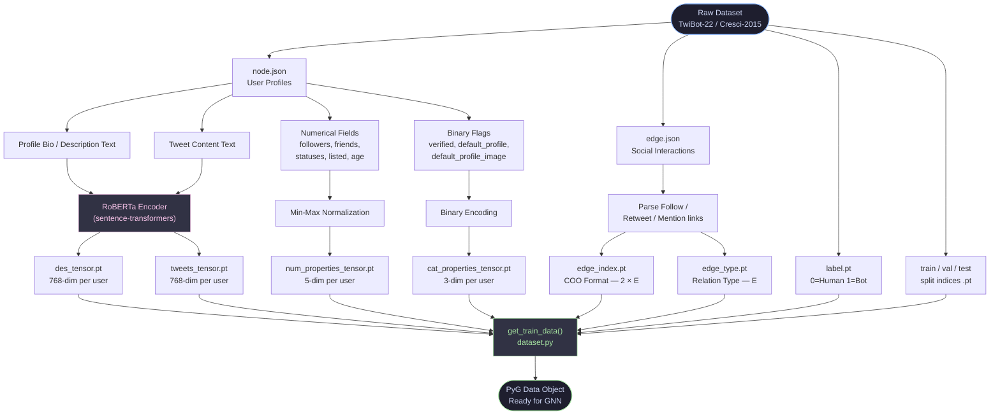
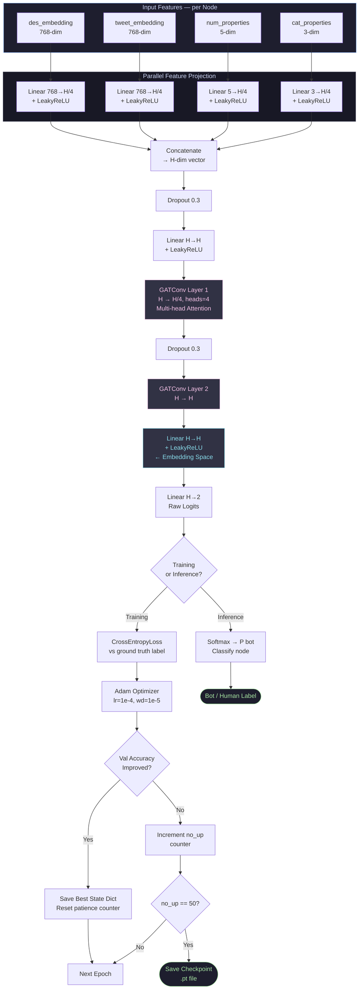
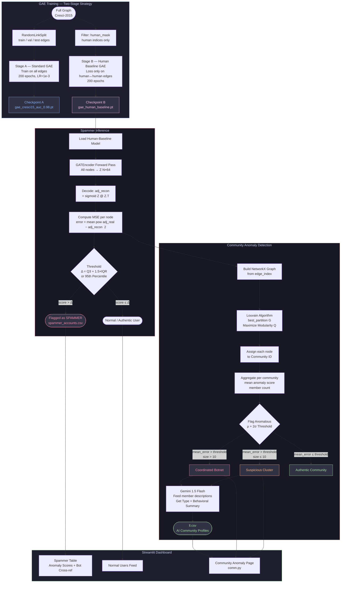

# Flowcharts — Anomalous Behavior Detection System

---

## Flowchart 1 — Feature Engineering & Graph Construction

### Explanation

The pipeline begins with two raw JSON sources: **node profiles** and **edge lists**. Each user profile is decomposed into three independent feature streams that are processed in parallel.

- **Semantic Stream** — The user's bio description and tweet content are fed separately into a pre-trained **RoBERTa** transformer. Each piece of text is converted into a 768-dimensional dense vector that encodes contextual meaning, tone, and topic. These are pre-computed once and saved as `.pt` tensors to avoid runtime overhead.

- **Numerical Stream** — Five scalar metrics (follower count, following count, total tweets, list memberships, account age in days) are extracted and normalized to a `[0, 1]` range using min-max scaling. This prevents high-magnitude features like follower counts from dominating lower-scale features.

- **Categorical Stream** — Three boolean flags (verified badge, custom profile image set, default avatar still active) are binary-encoded as `{0, 1}`. Despite being simple, these flags are strong signals because bot farms often skip profile customization.

The **edge lists** are converted into PyTorch Geometric's COO (Coordinate) sparse format — a `[2, num_edges]` tensor — representing directed social connections. A companion tensor stores the **relation type** for each edge (e.g., follow = 0, retweet = 1), preserving the semantic nature of the relationship.

All six tensors, along with ground-truth labels and data-split indices, are assembled by `get_train_data()` into a single **PyG `Data` object** that serves as the unified input to both the GAT and GAE models.

---

## Flowchart 2 — BotGAT Supervised Model Architecture & Training

### Explanation

The `BotGAT` model is a **multi-modal fusion classifier** that learns to separate bots from humans by combining content features with social graph structure.

**Feature Projection (Parallel Branches):** Each of the four feature types enters its own linear projection layer, compressing it to `H/4 = 32` dimensions. This makes every modality contribute equally to the final representation regardless of its original dimensionality (768-dim text vs. 3-dim flags). All branches use `LeakyReLU` to preserve negative-valued gradients.

**Feature Fusion:** The four projected vectors are concatenated into a single `H = 128`-dim vector per user. This fused representation is then passed through a linear input gate with dropout (0.3) and LeakyReLU, acting as a mixing layer before the graph convolutions.

**Graph Attention Layers:** Two `GATConv` layers perform **message passing** over the social graph. The key mechanism is the **attention coefficient** — each node computes a learned importance weight for each of its neighbors before aggregating their features. Layer 1 uses 4 attention heads (`heads=4`) which independently learn different relational patterns and concatenate results; Layer 2 collapses them back to `H` dims. This allows the model to naturally prioritize influential connections (e.g., an account heavily retweeted by known bots carries more signal than a random follower).

**Training Loop:** Uses `NeighborLoader` for scalable mini-batch training with 4-hop neighborhood sampling (`[25, 15, 10, 5]`). An **early stopping** mechanism monitors validation accuracy and saves the best checkpoint in memory — training halts after 50 epochs with no improvement.

**The Embedding Space:** The penultimate layer output (before the final `Linear H→2`) captures the learned graph representation and can be visualized using **t-SNE** to confirm that bot and human clusters are separable in latent space.

---

## Flowchart 3 — GAE Spammer Detection & Community Anomaly Analysis

### Explanation

This component operates entirely **without labels** — it detects anomalies by learning what "normal" looks like and flagging everything that deviates.

#### Two-Stage GAE Training

**Stage A (Standard Baseline):** A Graph Autoencoder is first trained using `RandomLinkSplit` — edges are hidden from the model during training, and the model earns a score based on how well it can reconstruct them (AUC ≈ 0.98). This produces a general-purpose graph encoder.

**Stage B (Human-Normality Baseline) — The critical innovation:** A second model is trained using **only human-to-human edges** in the loss function. Even though all nodes participate in the forward pass, the gradient signal comes exclusively from authentic social connections. After training, this model embodies a precise structural definition of *what a real person's social neighborhood looks like*. Any account — bot, spammer, or coordinated actor — whose neighborhood structure cannot be reconstructed accurately by this human-normality model will produce a **high reconstruction error**.

#### Spammer Detection via Reconstruction Error

At inference time, the trained encoder maps every user to a 64-dim latent vector `Z`. The decoder reconstructs the full adjacency matrix via `sigmoid(Z @ Z.T)`. The **per-node anomaly score** is the Mean Squared Error between the true adjacency row and the reconstructed row. Accounts are flagged as spammers if their score exceeds a statistical fence:
- **IQR fence:** `Q3 + 1.5 × IQR` (Tukey outlier criterion)
- **Percentile fence:** 95th percentile (stricter, used for dashboard)

Flagged accounts are saved to `spammer_accounts.csv`.

#### Community Anomaly Detection via Louvain

The same per-node anomaly scores are used at a **group level**. The social graph is converted to a NetworkX graph and the **Louvain algorithm** partitions it into communities by maximizing modularity `Q` — a measure that rewards dense intra-community connections and sparse inter-community connections. This naturally surfaces groups of accounts that interact with each other far more than with the rest of the network (a hallmark of coordinated bot behavior).

Each community is then scored by **averaging the anomaly scores of its members**. Communities whose mean score exceeds the global `μ + 2σ` threshold are considered structurally anomalous. These flagged communities — along with the combined bio text of all their members — are fed to **Gemini 1.5 Flash**, which produces a natural-language category label (e.g., *"Marketing-Centric Botnet"*) and a 3-sentence behavioral summary. Results are stored in `ll.csv` and rendered in the Streamlit community dashboard page.
