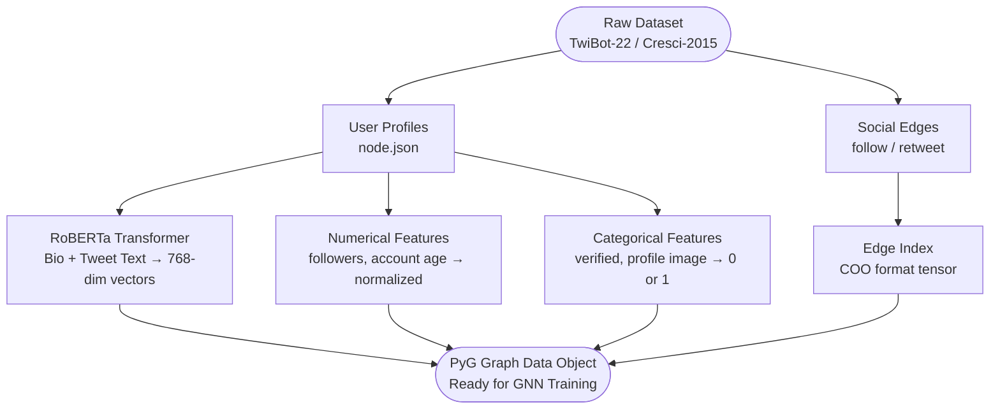
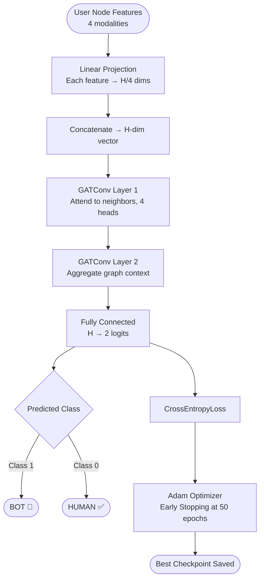
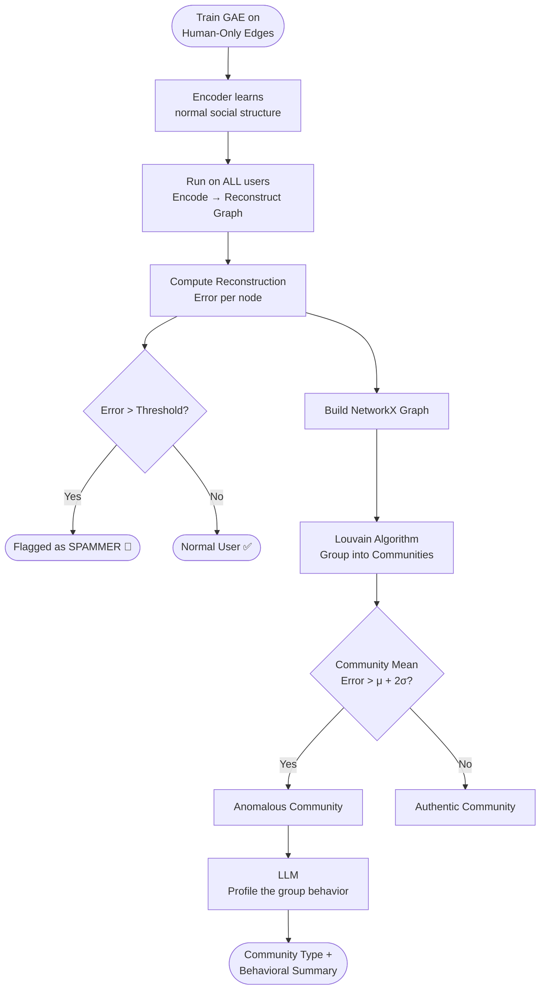

# Simple Flowcharts — Anomalous Behavior Detection System

---

## 1. Feature Engineering & Graph Construction

**Each user node = 4 feature types fused together. Edges represent real social links. The final PyG Data object is the input to both detection models.**

---

## 2. BotGAT — Supervised Bot Detection

**The attention mechanism lets each node weigh how important each neighbor is before aggregating, making the model effective at spotting coordinated clusters.**

---

## 3. GAE + Louvain — Spammer & Community Detection

**High reconstruction error = the model couldn't rebuild this user's social pattern from its learned idea of "normal". At community level, Louvain finds tightly-coordinated groups, and Gemini labels them in plain language.**

